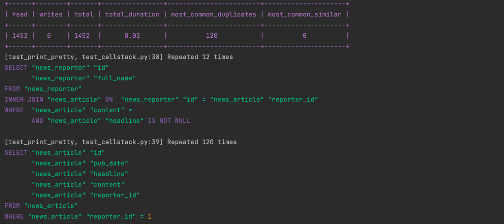

# django-query-capture

[](https://github.com/ashekr/django-query-capture/actions?query=workflow%3Abuild)
[](https://pypi.org/project/django-query-capture/)
[](https://github.com/ashekr/django-query-capture/pulls?utf8=%E2%9C%93&q=is%3Apr%20author%3Aapp%2Fdependabot)

[](https://github.com/psf/black)
[](https://github.com/PyCQA/bandit)
[](https://github.com/ashekr/django-query-capture/blob/main/.pre-commit-config.yaml)
[](https://github.com/ashekr/django-query-capture/releases)
[](https://github.com/ashekr/django-query-capture/blob/main/LICENSE)


## Overview



Django Query Capture can check the query situation at a glance, notice slow queries, and notice where N+1 occurs.

Some reasons you might want to use django-query-capture:

- It can be used to simply check queries in a specific block.
- It supports Django Middleware, Context Manager, and Decorator.
- When you use Context Manager, you can get real-time query data.
- You can see where the query occurs.
- Inefficient queries can be found in the test code.
- It is easy to customize by simply changing the table shape, changing the color, and selecting and setting the desired output.
- It supports customization that allows you to decorate the output freely from the beginning.
- Fully Documented
- It supports Type hint everywhere.

## Simple Usage

- Just add it to Middleware without any other settings, and it will be output whenever a query occurs.

```python
MIDDLEWARE = [
  ...,
  "django_query_capture.middleware.QueryCaptureMiddleware",
]
```

- Use in function-based views. or just function

```python
from django_query_capture import query_capture

@query_capture()
def my_view(request):
  pass
```

- Use in class-based views.

```python
from django.utils.decorators import method_decorator
from django.views.generic import TemplateView
from django_query_capture import query_capture

@method_decorator(query_capture, name='dispatch')
class AboutView(TemplateView):
  pass
```

- Use it as a context.

When used as Context, you can check the query in real time.

```python
from django_query_capture import query_capture

from tests.news.models import Reporter

@query_capture()
def run_something():
    with query_capture() as capture:
        Reporter.objects.create(full_name=f"target-1")
        print(len(capture.captured_queries))  # console: 1
        Reporter.objects.create(full_name=f"target-2")
        print(len(capture.captured_queries))  # console: 2
```

- Use in test

Test code can capture inefficient queries through the `AssertInefficientQuery` Util.


```python
from django.test import TestCase

from django_query_capture.test_utils import AssertInefficientQuery


class AssertInefficientQueryTests(TestCase):
    def test_assert_inefficient_query(self):
          with AssertInefficientQuery(self, num=19):
            self.client.get('/api/reporter')  # desire threshold count 19 but, /api/reporter duplicate query: 20, so raise error
```

## Installation

```bash
pip install -U django-query-capture
```

or install with `Poetry`

```bash
poetry add django-query-capture
```

## Full Documentation

Extension documentation is found here: [https://ashekr.github.io/django-query-capture/](https://ashekr.github.io/django-query-capture/).

## 🛡 License

[](https://github.com/ashekr/django-query-capture/blob/main/LICENSE)

This project is licensed under the terms of the `MIT` license. See [LICENSE](https://github.com/ashekr/django-query-capture/blob/main/LICENSE) for more details.

## Credits [](https://github.com/TezRomacH/python-package-template)

This project was generated with [`python-package-template`](https://github.com/TezRomacH/python-package-template)
