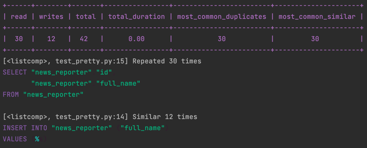

# django-query-capture

[](https://github.com/ashekr/django-query-capture/actions?query=workflow%3Abuild)
[](https://pypi.org/project/django-query-capture/)
[](https://github.com/ashekr/django-query-capture/pulls?utf8=%E2%9C%93&q=is%3Apr%20author%3Aapp%2Fdependabot)

[](https://github.com/psf/black)
[](https://github.com/PyCQA/bandit)
[](https://github.com/ashekr/django-query-capture/blob/main/.pre-commit-config.yaml)
[](https://github.com/ashekr/django-query-capture/releases)
[](https://github.com/ashekr/django-query-capture/blob/main/LICENSE)


## Overview



Django Query Capture 는 한 눈에 쿼리 상황을 확인하고, 느린 쿼리를 알아채고, N+1 이 일어나는 곳을 알아차릴 수 있습니다.

Query Capture 를 사용해야하는 사람들

- Django 의 어느 부분에서나 간단하게 쿼리를 확인하고 싶을 때 사용합니다.
- Django Middleware, with Context 및 Decorator 를 모두 지원합니다.
- with Context 를 사용했을 때는 실시간 쿼리 데이터를 받아올 수 있습니다.
- 단순히 테이블 형태를 바꾸거나, 색을 바꾸고, 원하는 출력을 선택하여 설정해 사용하는 간편하게 커스텀하여 수 있습니다.
- 출력을 처음부터 마음대로 꾸밀 수 있는 자유로운 커스터마이징을 지원합니다. ( 커스텀 할 수 있는 문서를 지원합니다. )
- Type Hint 지원


## Requirements

- Python (3.8, 3.9)
- Django(3.2, 4.0)

## Installation

```bash
pip install -U django-query-capture
```

or install with `Poetry`

```bash
poetry add django-query-capture
```

### Simple Usage

- Middleware 를 설정하면 모든 Request 의 쿼리를 확인할 수 있습니다.

```python
MIDDLEWARE = [
  ...,
  "django_query_capture.middleware.QueryCaptureMiddleware",
]
```

- Decorator 로 사용하기

```python
from django_query_capture import query_capture

@query_capture()
def run_something():
    pass
```
  
  - 함수형 view 에서 사용하기
```python
from django_query_capture import query_capture

@query_capture()
def my_view(request):
  pass
```

  - 클래스 기반 View 에서 사용하기
```python
from django.utils.decorators import method_decorator
from django.views.generic import TemplateView
from django_query_capture import query_capture

@method_decorator(query_capture, name='dispatch')
class AboutView(TemplateView):
  pass
```

- Context 로 사용하기

context 로 사용했을 경우 실시간으로 캡쳐된 쿼리를 확인할 수 있습니다.

```python
from django_query_capture import query_capture

from tests.news.models import Reporter

@query_capture()
def run_something():
    with query_capture() as capture:
        Reporter.objects.create(full_name=f"target-1")
        print(len(capture.captured_queries))  # console: 1
        Reporter.objects.create(full_name=f"target-2")
        print(len(capture.captured_queries))  # console: 2
```

### Settings

```python
QUERY_CAPTURE = {
    "PRINT_THRESHOLDS": {  # 아래 값들을 초과하면 콘솔에 출력됩니다.
        "SLOW_MIN_SECOND": 1,  # 시간
        "DUPLICATE_MIN_COUNT": 10,  # 중복 개수
        "SIMILAR_MIN_COUNT": 10,  # 비슷한 중복 개수
        "COLOR": "yellow",  # 임계치를 넘었을 시 출력에 사용 할 색
    },
    "PRESENTER": "django_query_capture.presenter.PrettyPresenter",  # 콘솔에 출력하는 Presenter 클래스
    "IGNORE_SQL_PATTERNS": [],  # 캡쳐하지 않을 regex 패턴 목록
    "PRETTY": {"TABLE_FORMAT": "pretty", "SQL_COLOR_FORMAT": "friendly"},  # PrettyPresenter 를 사용했을 때 커스텀할 수 있는 세팅 값
}
```

COLOR: [사용가능한 목록](https://github.com/django/django/blob/main/django/utils/termcolors.py)

TABLE_FORMAT: [사용 가능한 목록](https://github.com/astanin/python-tabulate#table-format)

SQL_COLOR_FORMAT: [사용 가능한 목록](https://pygments.org/styles/)

## 🛡 License

[](https://github.com/ashekr/django-query-capture/blob/main/LICENSE)

This project is licensed under the terms of the `MIT` license. See [LICENSE](https://github.com/ashekr/django-query-capture/blob/main/LICENSE) for more details.

## 📃 Citation

```bibtex
@misc{django-query-capture,
  author = {AsheKR},
  title = {Awesome `django-query-capture` is a Python cli/package created with https://github.com/TezRomacH/python-package-template},
  year = {2022},
  publisher = {GitHub},
  journal = {GitHub repository},
  howpublished = {\url{https://github.com/ashekr/django-query-capture}}
}
```

## Credits [](https://github.com/TezRomacH/python-package-template)

This project was generated with [`python-package-template`](https://github.com/TezRomacH/python-package-template)
