In the setting, you can set the threshold and the form of the output.<br>
If you don't set anything up, the default value below will go in.

```python
QUERY_CAPTURE = {
    "PRINT_THRESHOLDS": {  # If you exceed the values below, it will be output to the console.
        "SLOW_MIN_SECOND": 1,  # time thresholds
        "DUPLICATE_MIN_COUNT": 10,  # duplicate query thresholds
        "SIMILAR_MIN_COUNT": 10,  # similar query thresholds
        "COLOR": "yellow",  # The color you want to show when you go over the thresholds.
    },
    "PRESENTER": "django_query_capture.presenter.PrettyPresenter",  # Output class, if you change this class, you can freely customize it.
    "IGNORE_SQL_PATTERNS": [],  # SQL Regex pattern list not to capture
    "PRETTY": {"TABLE_FORMAT": "pretty", "SQL_COLOR_FORMAT": "friendly"},  # Setting values that can be customized when using PrettyPresenter.
}
```

## QUERY_CAPTURE

| name                  | description                                                                                                            | available value                                                                                       |
|-----------------------|------------------------------------------------------------------------------------------------------------------------|-------------------------------------------------------------------------------------------------------|
| `PRINT_THRESHOLDS`    | If you exceed the values below, it will be output to the console.<br>The table below contains additional explanations. | `dict`                                                                                                  |
| `PRESENTER`           | Output class, if you change this class, you can freely customize it.                                                   | Class that inherited [BasePresenter][presenter.base.BasePresenter].<br>Please refer to [How to Customize Presenter](../../api_guide/presenter/#how-to-customize-presenter)              |
| `IGNORE_SQL_PATTERNS` | SQL Regex pattern list not to capture                                                                                  | `list[str]`                                                                                             |
| `PRETTY`              | Setting values that can be customized when using [PrettyPresenter][presenter.pretty.PrettyPresenter].<br>The table below contains additional explanations. | `dict`                                                                                                  |

### PRINT_THRESHOLDS

| name                  | description                                                 | available value |
|-----------------------|-------------------------------------------------------------|-----------------|
| `SLOW_MIN_SECOND`     | time thresholds ( unit: second )                            | `int`             |
| `DUPLICATE_MIN_COUNT` | duplicate query thresholds                                  | `int`             |
| `SIMILAR_MIN_COUNT`   | similar query thresholds                                    | `int`             |
| `COLOR`               | The color you want to show when you go over the thresholds. | [Please refer to here for a list of available colors.](https://github.com/django/django/blob/main/django/utils/termcolors.py)             |

???+ hint "Similar vs Duplicate"
    First, let's define it simply and understand it with one example.<br>
    "Similar" has almost the same sql but only different parameters.<br>
    "Duplicate" has exactly the same sql.<br>

    This example is a "Similar" example.<br>
    The preceding SQL is the same, but only the parameters are different.
    ```python
    'INSERT INTO "news_reporter" ("full_name") VALUES (%s)' % ('gil')
    'INSERT INTO "news_reporter" ("full_name") VALUES (%s)' % ('young')
    'INSERT INTO "news_reporter" ("full_name") VALUES (%s)' % ('ashe')
    ```

    This example is a "Duplicate" example.<br>
    It's exactly the same.
    ```python
    'INSERT INTO "news_reporter" ("full_name") VALUES (%s)' % ('ashe')
    'INSERT INTO "news_reporter" ("full_name") VALUES (%s)' % ('ashe')
    'INSERT INTO "news_reporter" ("full_name") VALUES (%s)' % ('ashe')
    ```

??? example "Custom color example"
    It applies only to table colors.

    - `red`
    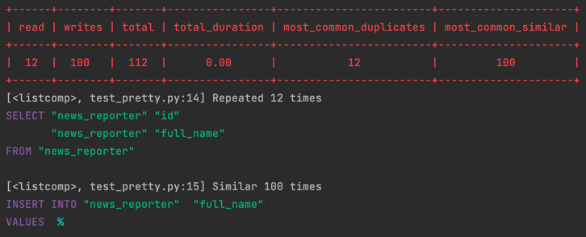
    - `green`
    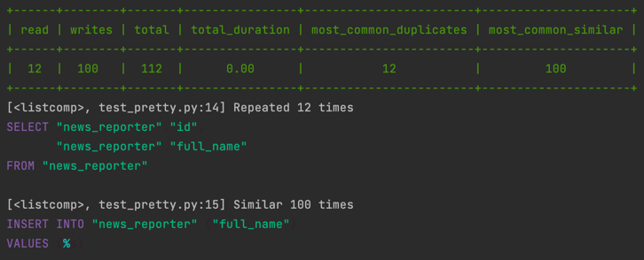
    - `yellow`
    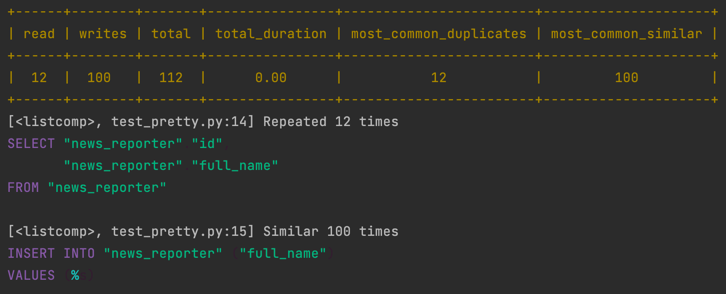
    - `blue`
    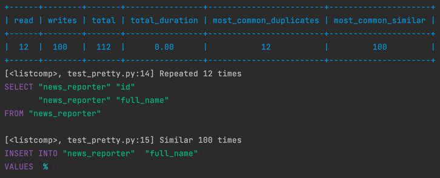
    - `magenta`
    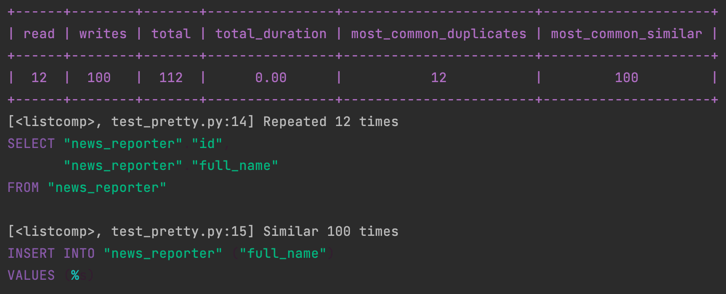
    - `cyan`
    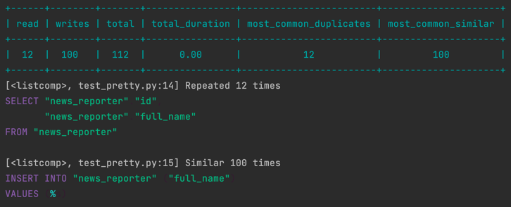
    - `white`
    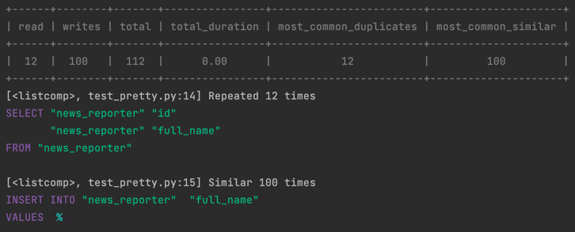

### PRETTY

| name               | description                                          | available value                                                 |
|--------------------|------------------------------------------------------|-----------------------------------------------------------------|
| `TABLE_FORMAT`     | You can specify the form of the table.               | [Please refer to this place for the form that can be designated.](https://github.com/astanin/python-tabulate#table-format) |
| `SQL_COLOR_FORMAT` | You can adjust the color format when outputting SQL. | [Please refer to this place for the form that can be designated.](https://pygments.org/styles/) |

??? example "Custom table format example"

    All settings can be found [here](https://github.com/astanin/python-tabulate#table-format).

    - `plain`
    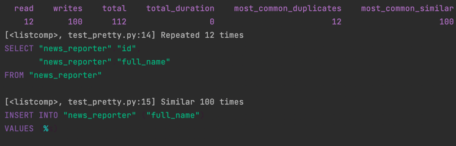
    - `simple`
    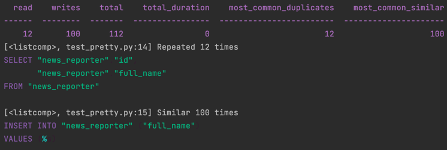
    - `github`
    
    - `grid`
    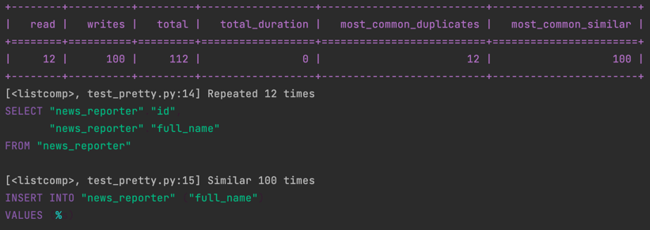
    - `fancy_grid`
    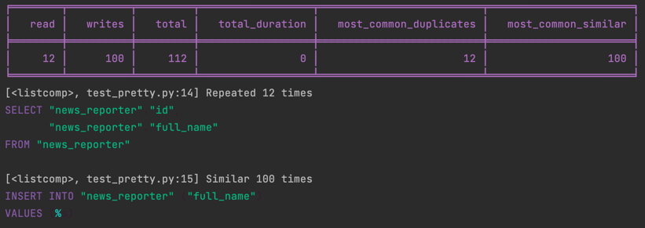
    - `presto`
    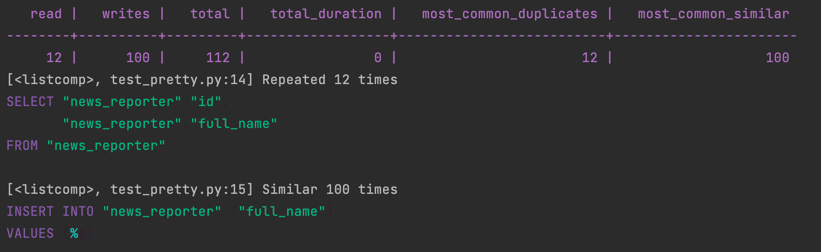
    - `pretty`
    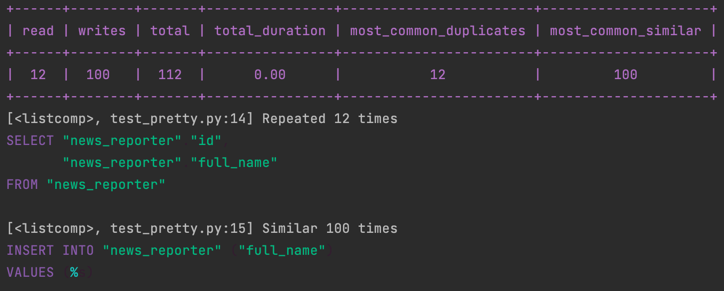
      - `psql`
    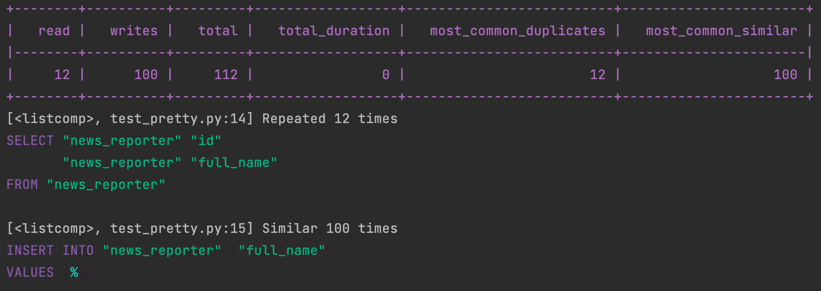
    - `pipe`
    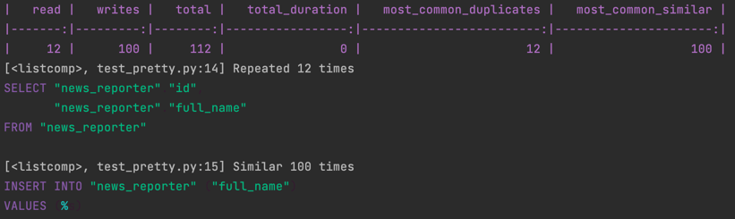
    - `orgtbl`
    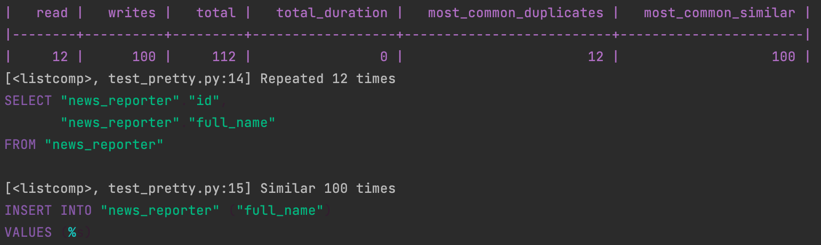

??? example "Custom sql color format example"

    All settings can be found [here](https://pygments.org/styles/).

    - `zenburn`
    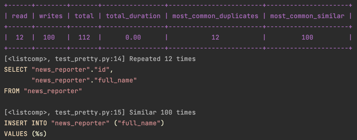
    - `material`
    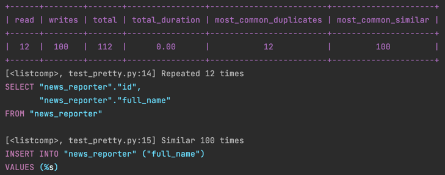
    - `one-dark`
    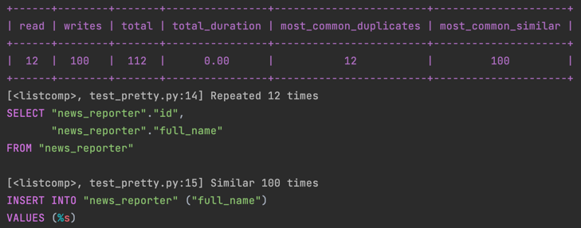
    - `dracula`
    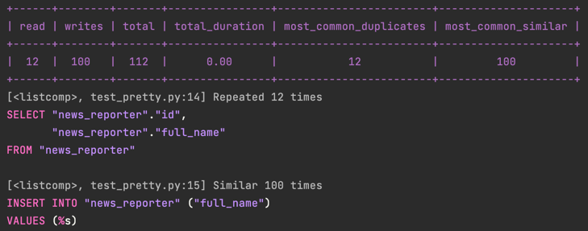
